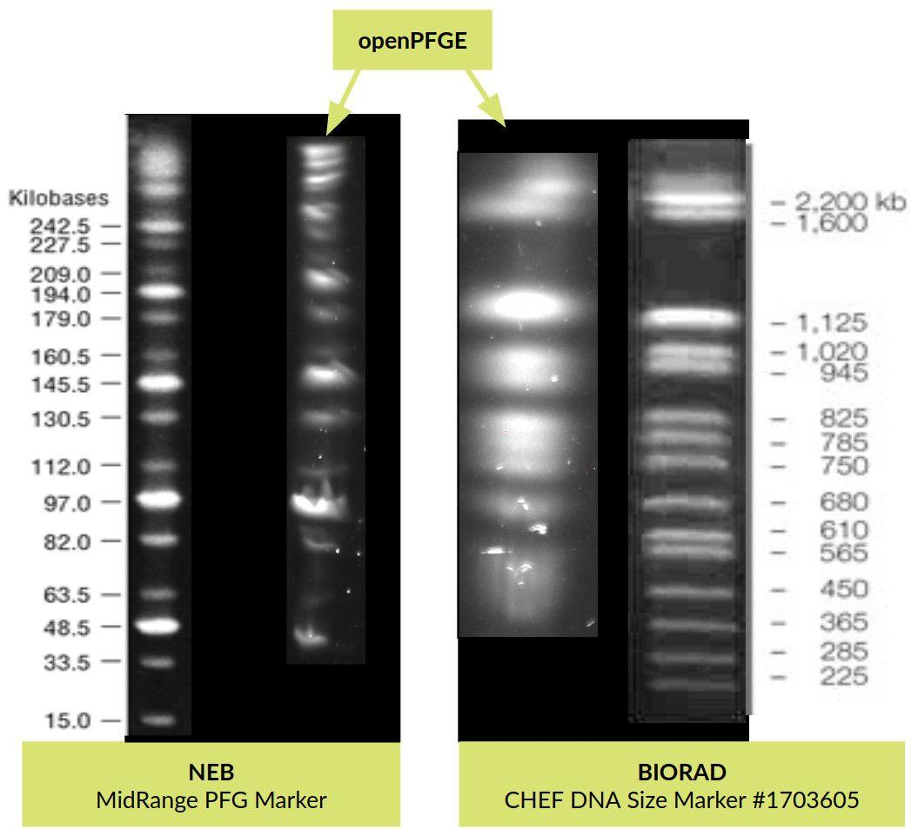

# openPFGE

Open source and low cost pulsed-field gel electrophoresis [PFGE] equipment.

  
Intro | Description | Results | Costs

## Intro
Biochemistry - including biotechnology, molecular biology, protein engineering, among others - is an area were high sophisticated equipment is required. In general, just a few equipment have an open source version - i.e. PCR - and, because of low offerer number, costs of these equipment tent to be overpriced, limiting it access to many research centers or labs.

## Description
Pulsed-field gel electrophoresis [PFGE] is a technique that allows the separation of very large DNA molecules - up to ~10 Mbp, in contrast of up to ~50 Kbp of normal electrophoresis - by a periodic change in the direction of the electric field, widely used in many biochemistry labs. This work considers the design and construction of a open source and low cost PFGE, implementing a Rotating Gel Electrophoresis (RGE). The design considers the use of a standard commercially available electrophoresis chamber and the construction of an agarose gel rotation system using 3D printed parts, a servo motor and simple electronics.

In order to keep the design simple and low cost as possible, a gel rotation system inside a standard large electrophoresis chamber was designed to achieve the electric field direction change of the PFGE. The gel rotation system considers simple 3D printed parts composed of: a tray, that supports the gel; a tray cover, that fixes the gel position; a stem, that goes from the tray cover through the electrophoresis chamber cover and joins the servo motor; and, a joint, of the stem to the servo motor that allows easy release of the tray. It also considers a 180 degrees, 5 [V], high speed and accuracy digital servo motor that allows the PFGE to move at any angle.

The buffer cooling system is composed of a small 12V pump that circulates the buffer through a peltier cooler elements based refrigeration system. A NTC epoxy thermistor temperature sensor provides the capacity to retrieve the current buffer temperature in order to feedback the cooling system.

The circuit is driven by an Arduino Nano microprocessor. It holds a serial OLED module to display the parameters of the electrophoresis run independent from the smartphone. Fans and the pump are controlled by digital outputs through high current MOSFETs. It considers a Bluetooth module to provide communication to a smartphone for system control.

## Results & costs
The equipment is capable of the separation of DNA molecules up to ~2 Mbp [See *Fig 1*] with the same protocols as commercial equipment. A 10 Mpb marker is about to be tested. It costs USD ~$500, about 1/50 of the price of commercial equipment, considering the chamber and the power source. All coding, electronics, 3D parts and documentation is public available on GitLab.

**Fig. 1 |** Two commercial markers separated by openPFGE in contrast to references  

# Fabrication and assembly

1. Aquire all components listed in the hardware part list section
2. Print all parts in the last folder of *3D printing* folder using PLA at 0.25mm layer height, except for *pin.FCStd* that had 0.1mm layer height. See *Pictures/Gel_tray.jpg* and *Pictures/Servo_motor_support_and_join.jpg* to see how they look like in the final assembly.
3. Using some strong glue, put the magnets in the *motor joint* part as shown in *Pictures/Magnets_motor_joint.jpg* and in the *tray cover joint* part
4. Using some fishing line build the gel tray as shown in *Pictures/Gel_tray.jpg*
5. Fabricate the circuit PCB using the last version of the *fzz* file in the *Circuit* folder. You can find a good price and service at [AISLER](https://aisler.net/)
6. Assemble the circuit by soldering the parts to the PCB. The PCB has the description of the components on its skilscreen. A picture of the PCB assembly is at *Circuit/Pictures/Circuit_assembly.jpg*.
7. Assemble the servo motor to its printed support. Attach the *motor joint* to the servo arm.
8. Power the 12V power source to the circuit
9. Download [the Android app](https://play.google.com/store/apps/details?id=cl.paralelos.openpfge)
10. Turn on the circuit switch and start your electrphoresis

# Hardware parts list
## Gel rotating system
### Electrophoresis chamber
Design of motor support was made based on [BT103](https://www.btlabsystems.com/Agarose_Electrophoresis_BT103) electrophoresis chamber:

- Gel Dimension: 60 x 60, 120 x 60, 60 x 120, 120 x 120mm
- Number of samples: 6, 8, 11, 13, 18, 25
- Comb thickness: 1.0, 1.5 & 2.0mm
- Buffer volume: 650ml

### Servo
- Digital servo DS3218 [like this one](https://aliexpress.com/item/1943129663.html)
- Print 1 X *motor joint.FCStd*
- Print 1 X *motor support.FCStd*
- 4 X 3mm diameter / >10 mm length screw-nut to fix the servo to the *motor joint*
- 1 X 3mm diameter / 6 mm length screw-nut to fix the servo to the *motor support*
- 1 X 3mm diameter / 12 mm length screw-nut to fix the servo to the *motor support*
- 2 X 7mm diameter / 5 mm height N35 magnet [like this one](https://aliexpress.com/item/32277590868.html)

### Gel tray
- Print 2 X *pin.FCStd*
- Print 1 X *tray.FCStd*
- Print 1 X *tray cover.FCStd*
- Print 1 X *tray cover joint.FCStd*
- 2 X 7mm diameter / 5 mm height N35 magnet [like this one](https://aliexpress.com/item/32277590868.html)
- 30 cm fishing line

### Refigeration system
- Peristaltic Pump 12V [like this one](https://aliexpress.com/item/32882495060.html)
- Peltier cooler 12V [like this one](https://aliexpress.com/item/33028954404.html)

## Circuit parts list

### Microcontroller
Arduino Nano v3.0 ATMEGA328P [like this one](https://aliexpress.com/item/32824272738.html)

### Bluetooth
HC-05  [like this one](https://aliexpress.com/item/32953559442.html)

### Power
- L7805CV Transistor voltage regulator (1.5 A) with a heat disipator
- 100 uF capacitor
- 10 uF capacitor
- Diode 1A [like this one](https://components101.com/1n4007-diode)
- 12V / 30 A power source [like this one](https://aliexpress.com/item/32917708245.html)
- Power switch

### LCD
LCD I2C 16x2 [like this one](https://aliexpress.com/item/32786773241.html)

### Refigeration
- 1 X Epoxy NTC thermistor temperature sensor 10K 1% [like this one](https://aliexpress.com/item/32654331022.html)
- 3 X Diode 1A [like this one](https://components101.com/1n4007-diode)
- 5 X MOSFET > 1.5A [like this one](https://components101.com/transistors/irf1010e-mosfet)
- 6 X 10K resistor

### Input / Output
- 8 X Screw Terminal / 3.5mm / 2 pins
- 1 X Screw Terminal / 3.5mm / 3 pins

# Android APP
Available at [Google play](https://play.google.com/store/apps/details?id=cl.paralelos.openpfge).
Source code available at *App Android* folder.

# License

- Hardware license: CERN Open Hardware License 1.2
- Software license: GPL v3
- Documentation license: CC BY 4.0 International

# Thanks to
## 3D printing
[Fablab U. de Chile](http://fablab.uchile.cl/)
## app
Item picker [link](https://gist.github.com/kristopherjohnson/660656bb9e18e23146c0)
## firmware
Thermistor code [link](https://learn.adafruit.com/thermistor/using-a-thermistor)
## logo
Based on logo by [link](https://www.instagram.com/rubenferlodotcom/)

# Contact
Fell free to write about any questions to [diego.lagos.s@ug.uchile.cl](mailto:diego.lagos.s@ug.uchile.cl)